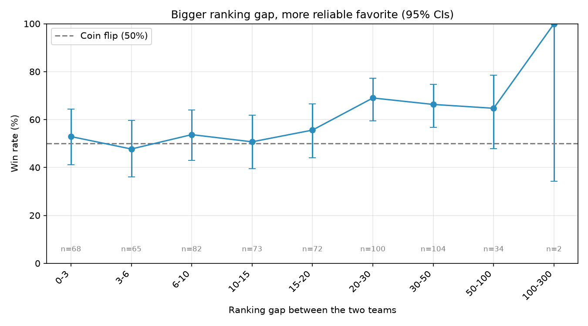
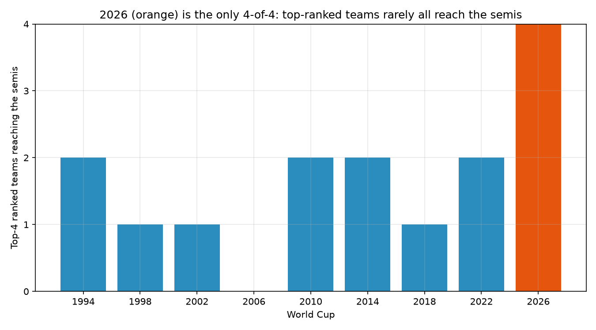

# FIFA Ranking vs. World Cup Outcomes

Do pre-tournament FIFA rankings actually predict who wins World Cup matches — and at what point does a ranking gap stop meaning anything?

This repo is an empirical study of that question. It builds a clean, reproducible dataset of every World Cup match paired with each team's FIFA ranking as of the release right before that tournament, then measures how well "always bet the higher-ranked team" would have done.

**🔗 Live interactive dashboard: [bishal.xyz/fifa-analysis](https://bishal.xyz/fifa-analysis)**

## The motivating question

The 2026 World Cup was claimed to be the first tournament where the four highest-ranked teams entering the tournament all reached the semi-finals. If rankings were a strong predictor, that alignment would be unremarkable — so why would it be a first? That tension is the starting point. The 2026 claim is treated as something to verify from data, not a premise.

Three questions drive the analysis:

1. **Baseline strategy** — across every World Cup since FIFA rankings began (1994 onward), if you always picked the higher-ranked team, what fraction of matches would you win?
2. **Semi-finalist alignment** — for each tournament, how many of the four top-ranked teams actually reached the semi-finals? Is 2026 really the first 4-of-4?
3. **Ranking-gap sensitivity** — as you sweep a threshold over the rank gap between two teams, where does betting the favorite stop beating a coin flip? That crossover is the "noise floor" of the ranking signal.

## Approach in brief

- **Scope:** World Cup tournament matches only (1994–2026, ~604 matches). No qualifiers, friendlies, or confederation tournaments.
- **Ranking snapshot:** the last FIFA ranking published before each tournament's opening match, reused for every match in that tournament.
- **Winner:** for knockout ties, whoever advances (extra time or penalty shootout) is the winner.
- **Draws:** counted as a loss for the default strategy, but the design keeps this pluggable so other treatments (exclude, half-credit) can be explored.
- **Rankings carried:** both ranking *position* and ranking *points* are joined onto every match, for both teams.

## Data sources

Raw data is downloaded into `data/raw/` and is not hand-edited. The loaders in `src/fifa/ingest.py` are the single place that knows where files live and what their columns are.

- **Matches / shootouts / former names** — Kaggle: martj42, "International football results from 1872 to present". Filtered to `tournament == "FIFA World Cup"`.
- **Rankings 1993–2018** — Kaggle `fifa_ranking.csv` (weekly snapshots).
- **Rankings 2022 & 2026** — FIFA ranking JSON exports (`data/raw/2022-rankings.json`, `2026-rankings.json`), since those tournaments aren't covered by the Kaggle CSV.

### Data sources and terms

The datasets in `data/raw/` are third-party and carry their own licenses and terms — this repo's MIT license covers only the code. Please consult each source before reusing the data:

- **Matches, shootouts, former names** — the martj42 "International football results from 1872 to present" dataset on Kaggle. Refer to that dataset's page for its license and attribution requirements.
- **FIFA ranking history (1993–2018)** — a FIFA-rankings dataset on Kaggle (`fifa_ranking.csv`).
- **2022 & 2026 ranking snapshots** — pre-tournament FIFA rankings sourced from FIFA.com.

> Data note: the 2026 tournament figures are included as loaded from the source and should be verified against official results before being cited.

## Setup

Requires Python 3.12+ and [uv](https://docs.astral.sh/uv/).

```bash
uv sync        # create the virtualenv and install dependencies
uv run fifa    # smoke test: prints the in-scope tournaments
```

## Running the analysis

The analysis lives in `notebooks/cleanup.ipynb`. Run it end to end:

```bash
uv run jupyter nbconvert --to notebook --execute --inplace notebooks/cleanup.ipynb
# or explore interactively:
uv run jupyter lab
```

It produces:

- `notebooks/wc_ranking_stats.xlsx` — every summary table (overall win rate, per-tournament, group vs. knockout, rank-gap buckets with confidence intervals, threshold sweep, host effect, biggest upsets, semi-finalist alignment) plus the full match-level table, with a Definitions sheet.
- `notebooks/fifa_dashboard.json` — the same aggregates in a compact shape for a web dashboard.
- `notebooks/figures/*.png` — the charts below.

## Results at a glance

Across 600 ranked World Cup matches (1994–2026), always backing the higher-ranked team wins about **58%** of the time — against an **~82% ceiling** (draws count as losses, so a perfect predictor still couldn't reach 100%). The signal is strongest in knockouts and at large ranking gaps, and close to a coin flip for tightly matched teams.





## Caveats

- **Small samples.** Nine tournaments, ~600 matches; each rank-gap bucket has far fewer, so confidence intervals are wide. Any "optimal gap" reading needs its interval, not a point estimate.
- **2018 methodology change.** FIFA changed how rankings are computed in August 2018, so a rank gap pre- and post-2018 aren't perfectly comparable. Treated as a documented caveat, not a regime split.
- **Draws cap the ceiling.** With draws as losses and a ~18% draw rate, the strategy tops out near 82%, not 100%. Compare win rates to that ceiling.
- **Host bias.** Hosts tend to over-perform their ranking, so host matches are a known adverse subset.

## License

Code is released under the [MIT License](LICENSE). Third-party data under `data/raw/` is subject to its own terms — see "Data sources and terms" above.
